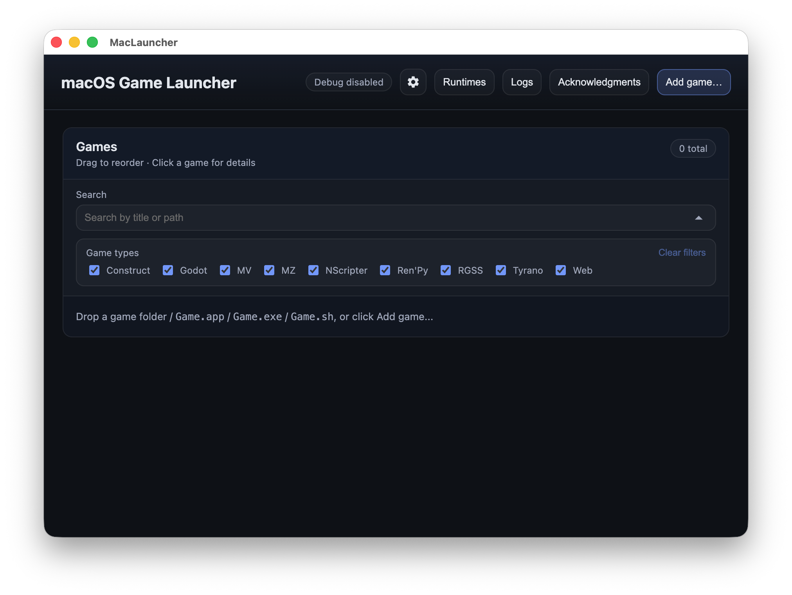

# MacLauncher

macOS app to easily launch various games natively.

## Idea
A surprising number of games have runtimes that are available on macOS (and Linux) even though the games themselves are packaged for Windows and don't work out of the box. These games don't require WINE or emulation, and running natively can gain you higher performance and (sometimes) better compatibility. The purpose of this launcher is to configure these native runtimes automatically so you can just drag in a game directory or exe and start playing. The app is written in Electron so that web games don't require any additional downloads.

This launcher started by taking the patches in https://github.com/bakustarver/rpgmakermlinux-cicpoffs to macOS and wrapping it all in a UI, although I have added more features since then.

Note: this project is in an early stage of development! It works fine for me, but compatibility isn't perfect, there are some UI quirks and inefficiencies I have yet to iron out, and there are many features I'd like to add that aren't available yet. Certain programming/design decisions might be idiotic because approximately 100% of the code was generated by various LLMs (I don't know any frontend dev).

## Why use MacLauncher?

There are quite a few benefits to using native macOS runtimes for games, even when CrossOver compatibility is quite good and some developers distribute native mac builds.
- Games are generally more performant and efficient running under native runtimes compared to CrossOver/WINE.
- Compatibility is often better on native runtimes as well, although sometimes it goes the other way.
- Native runtimes have better OS integration (window management, mouse behavior, etc).
- Many .app deployments for indie games (e.g. itch.io) are broken because the developer just clicked "build for mac" and Apple notarization quirks tell you you can't open the game. Running with a properly signed SDK solves this issue for good.

In addition, MacLauncher contains a suite of tools for extracting, decompiling, adding cheats into many of the game types it supports, some of which are unique and custom written for the MacLauncher project (the RPGMaker cheats in particular).

MacLauncher is different from many other game launchers in that it is **local first** (provide your own game files), with no integrations with storefronts, and will never connect to the internet at all except for downloading and managing remote runtime versions. It is more of a manager/power tool geared towards tinkerers rather a traditional launcher.

## Running the launcher
The easiest way to run is through MacLauncher.app in the Releases. It is unsigned and you will need to allow it through Gatekeeper because I don't want to pay Apple $100 per year for a developer ID. Also, this version will probably be behind the latest development version on GitHub and is not very well-tested (I run it from source).

To run the launcher from source, you need to [install Node.js and npm](https://docs.npmjs.com/downloading-and-installing-node-js-and-npm). Steps to install:
- `git clone --recurse-submodules git@github.com:procrastinine/maclauncher.git`
- `cd maclauncher`
- `npm install`

Steps to run:
- Run the launcher with `npm run dev` or `npm run dev:debug`.
- It can be packaged as a macOS app via `npm run package:mac`.
- The user data is in `~/Application Support/maclauncher`.

Steps to update:
- `git pull --recurse-submodules`
- `npm install` or `npm ci` (if node modules are updated)

## Game support
Currently supported:
- Web-based games (RPGMaker MV/MZ, Construct 2/3, TyranoBuilder, generic HTML)
- RPGMaker XP/VX/VX Ace (via [MKXP-Z](https://github.com/mkxp-z/mkxp-z))
- Ren'Py
- Godot
- NScripter (via [Onscripter-Yuri](https://github.com/YuriSizuku/OnscripterYuri))

Support planned:
- Java (with JRE version manager)
- Flash (via [Ruffle](https://github.com/ruffle-rs/ruffle) or Adobe Flash Projector)
- LÖVE
- XNA4 (via [FNA](https://github.com/FNA-XNA/FNA))
- Haxe (via [HashLink](https://github.com/HaxeFoundation/hashlink))
- Infinity Engine (via [GemRB](https://github.com/gemrb/gemrb))
- M.U.G.E.N. (via [Ikemen-Go](https://github.com/ikemen-engine/Ikemen-GO))
- Visual novels: KiriKiri (via [krkrsdl2](https://github.com/krkrsdl2/krkrsdl2)), RealLive (via [RLVM](https://github.com/eglaysher/rlvm)), M.A.G.E.S. (via [impacto](https://github.com/CommitteeOfZero/impacto)), AliceSoft (via [system3-sdl2](https://github.com/kichikuou/system3-sdl2), [xsystem35-sdl2](https://github.com/kichikuou/xsystem35-sdl2), [xsystem4](https://github.com/nunuhara/xsystem4)), CatSystem2 (via [FelineSystem2](https://github.com/kokseen1/FelineSystem2))

Support not planned:
- Games requiring WINE: CrossOver is better.
- Games already supported on RetroArch on mac: e.g. ScummVM, EasyRPG.

## Features
- Includes a runtime download manager UI for installing NW.js, MKXP-Z, Onsyuri, and Ren'Py SDK, so you can use any version(s) you want and track your installs.
- Includes bundled runtimes as well (Electron, MKXP-Z).
- You can create macOS `.command` shortcuts for individual games to run just by double-clicking.
- Edit per-game and per-game type settings for the available runtimes.
- Includes cheats for RPGMaker XP/VX/VX Ace/MV/MZ and Ren'Py, and will include cheats and save editing for more types of games as development continues.
- Supports extraction of Ren'Py, Godot, and RPGMaker archive and code files.
- Offline by default (web runtimes): block telemetry.
- Drag and drop to add games, or select via file dialog.
- Can unpack some exe files to extract and run from game data.
- Can in principle work with HTML5 games with Steamworks (via Greenworks), but untested.

## Docs
- `docs/REPO_GUIDE.md` (doc index and architecture overview)
- `docs/MODULES.md` (module contract and detection)
- `docs/UI_GUIDE.md` (launcher UI walkthrough)
- `docs/DATA_MODEL.md` (settings and storage schema)
- `docs/RUNTIMES.md` (runtime managers and launch flow)
- `docs/cheats.md` (cheats runtime and patching)
- `docs/DEVELOPMENT.md` (local dev workflow)
